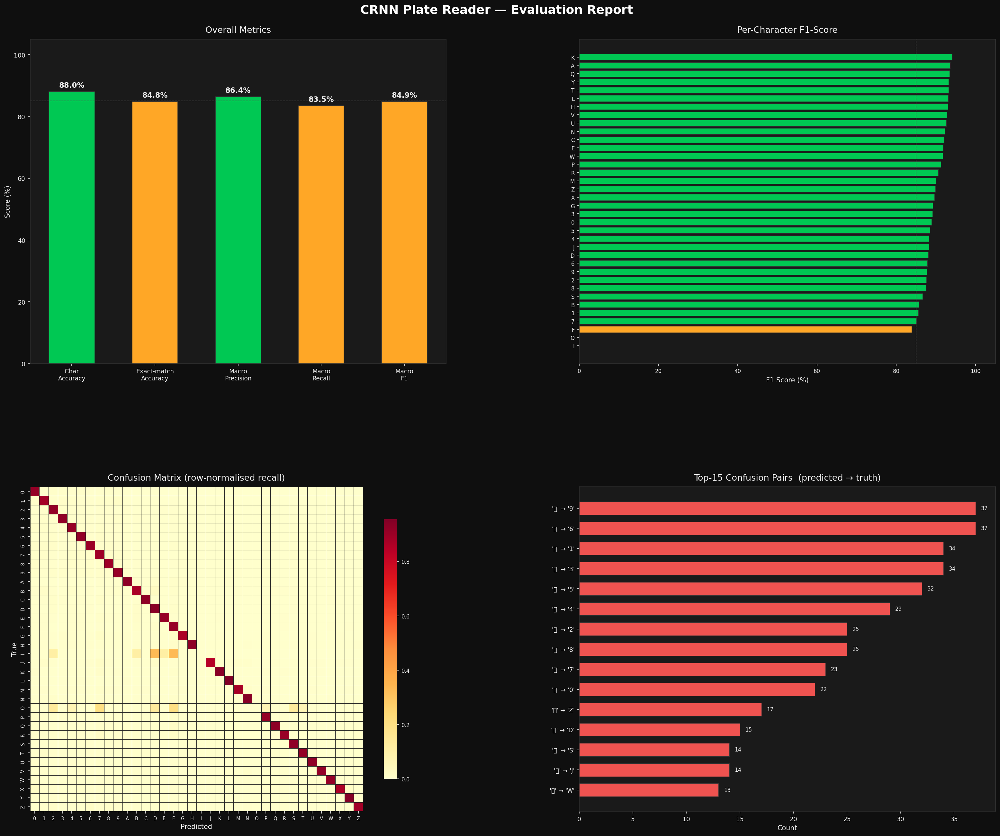

# AI Vehicle Access Control — ALPR 🚘
**CAP4630 · Introduction to Artificial Intelligence**

## Overview

This project develops an AI Vehicle Access Control system for automated license plate recognition and secure site authentication. Using a hybrid pipeline of CNN-based detection and CRNN-based sequence recognition, the model achieves **88.04% character accuracy** and **84.82% exact-match accuracy**, providing a reliable and auditable solution for real-world gatekeeper management.

[Demo]()

## Project Objectives

The primary goal of this project is to:

- Replace manual or RFID-based gate systems with an automated, reliable license plate recognition pipeline.

- Utilize a robust CRNN + CTC model to accurately read license plates under challenging conditions like motion blur and low light.

- Apply fuzzy clustering (Levenshtein) across multiple frames to eliminate noise and ensure high-confidence identification.

- Provide a browser-based dashboard for real-time monitoring and operator control (manual registration/denial).

- Automatically log all entry attempts to provide a verifiable history of site traffic.


## System Pipeline

1. **Capture**: Streams live video frames via WebSocket from the mobile camera to the Flask server.

2. **Localization (PlateCNN)**: A 5-layer binary CNN identifies the license plate region of interest (ROI) and crops the frame.

3. **Recognition (CRNN + CTC)**: The plate crop is normalized (CLAHE) and fed into a Convolutional Recurrent Neural Network to perform sequence recognition without needing manual character segmentation.

4. **Validation (Multi-Frame Voter)**: Readings are collected in a sliding window of 6 frames and aggregated using Levenshtein fuzzy clustering to eliminate transient "glitch" reads caused by motion blur or poor lighting.

5. **Authentication**: The high-confidence voted plate is checked against the authorized whitelist.csv.

6. **Operator Interaction**: The web UI displays a real-time ALLOWED/DENIED status. For unrecognized plates, the operator is prompted to either register the vehicle (adding it to the database) or deny entry.

7. **Logging**: Every scan, including the timestamp and the final access decision, is recorded to an auditable CSV log file.


## Model Architecture

The system utilizes a modular, two-stage deep learning pipeline to transform raw video frames into validated alphanumeric strings.

1. Plate Detector (Binary CNN) -
The first stage is a custom PlateCNN responsible for region-of-interest (ROI) localization.

- **Input**: 64x128 RGB image patches sampled from the video stream.

- **Architecture**: A 5-layer Convolutional Neural Network consisting of three convolutional layers with ReLU activation and Max-Pooling, followed by two fully connected layers.

- **Function**: Outputs a binary classification (Plate vs. Background) to trigger the OCR pipeline only when a valid vehicle plate is localized.

2. OCR Engine (CRNN + CTC) -
The core of the recognition system is a Convolutional Recurrent Neural Network (CRNN), which treats license plate reading as a sequence labeling task rather than individual character classification.

- **CNN Backbone**: Extracts deep spatial features from 32x128 grayscale plate crops.

- **Sequence Modeling**: A Bidirectional LSTM (Long Short-Term Memory) layer processes the CNN feature maps to capture the spatial dependencies between characters.

- **Transcription Layer**: Utilizes Connectionist Temporal Classification (CTC) Loss, allowing the model to predict character sequences of varying lengths (5–7 characters) without requiring pre-segmented character labels.


## Dataset Sources

| Dataset | Source | Used For |
|---|---|---|
| Car Plate Detection | [Kaggle — andrewmvd](https://www.kaggle.com/datasets/andrewmvd/car-plate-detection) | Plate detector training |
| License Plate Recognition v11 | [Roboflow Universe](https://universe.roboflow.com/roboflow-universe-projects/license-plate-recognition-rxg4e) — CC BY 4.0 | Plate detector training |
| Synthetic FL plates (~15,000) | Self-generated (`train/generate_florida_plates.py`) | CRNN training |
| Self-collected real photos (~502) | Neighborhood + parking garage (manually labeled) | CRNN training |


## Training

> Only needed if you want to retrain from scratch or add more data.

### CRNN (primary OCR model)
```bash
python train/train_crnn.py --epochs 50 --lr 0.001
```

### Plate Detector
```bash
python train/train_detector.py
```

### Add real photos to the training set
```bash
python train/ingest_photos.py --photos /path/to/your/photos
```

## Model Evaluation (Validation Set — 3,102 samples)

| Metric | Score |
|---|---|
| Character Accuracy | 88.04% |
| Exact-match Accuracy | 84.82% |
| Average Precision | 86.39% |
| Average Recall | 83.53% |
| Average F1-Score | 84.88% |

### Evaluation Chart



*The gap between Character Accuracy (88.04%) and Exact Match Accuracy (84.82%) indicates that most prediction errors come from single-character misclassifications, rather than complete plate failures*


## Challenges Faced

#### Florida-Specific Recognition

During the evaluation, we observed that the model initially struggled with Florida-specific license plates due to a lack of representative data in public datasets.
 - To address this, we collected 300 custom photos from local parking environments and generated 15,000 synthetic Florida plates to teach the model the specific geometry and colors of regional tags.
 - While this approach significantly increased the success rate from the baseline, the "orange" graphic and variable lighting in real-world environments remain a source of character-level confusion. Although the exact-match accuracy remains under 90%, the model demonstrates a successful proof-of-concept for domain-adapted access control.

## Technologies Used

- **Deep Learning Framework**: PyTorch (custom CNNs + CRNN + CTC) 
- **Computer Vision**: OpenCV + CLAHE contrast normalization 
- **Web Server**: Flask + Flask-SocketIO 
- **Real-time Comms**: WebSocket (Socket.IO) 
- **Frontend**: HTML5 + JavaScript (getUserMedia API) 
- **Database**: CSV (whitelist) + CSV (event logs) 
- **Training Acceleration**: Apple MPS (Metal) — M1/M2/M3 Macs 
- **Primary OCR**: Custom CRNN + CTC (trained from scratch) 
- **Multi-frame Voting**: Levenshtein fuzzy clustering 
- **Deployment**: Google Cloud Run 
- **Async Worker**: Eventlet 


## Prerequisites

- **Python 3.10 or 3.11** (3.12+ not yet supported by all dependencies)
- **pip** (comes with Python)
- A Mac with Apple Silicon **or** a machine with a CUDA GPU (CPU works but training will be slow)
- A phone and computer on the **same Wi-Fi network** to use the live camera UI


## Installation

### 1. Clone the repository
```bash
git clone https://github.com/metadavi/CAP4630_INTRO-TO-AI_PROJECT.git
cd CAP4630_INTRO-TO-AI_PROJECT
```

### 2. Create and activate a virtual environment
```bash
python3 -m venv .venv
source .venv/bin/activate        # macOS / Linux
# .venv\Scripts\activate         # Windows
```

### 3. Install dependencies
```bash
pip install -r requirements.txt
```

> **Apple Silicon (M1/M2/M3):** PyTorch will automatically use the Metal (MPS) backend — no extra steps needed.  
> **NVIDIA GPU:** Make sure your CUDA version matches the PyTorch wheel. See [pytorch.org](https://pytorch.org/get-started/locally/).

### 4. Verify the trained weights are present
```
models/
  plate_crnn.pth       ← CRNN OCR model  (required)
  plate_detector.pth   ← plate detector  (required)
  char_classifier.pth  ← char fallback   (optional)
```
These are committed to the repo. If they are missing, retrain — see **Training** below.


## Usage 

### Running the Server

```bash
python server.py
```

The terminal will print a local URL like:
```
https://192.168.x.x:8080
```

Open that URL on your phone (same Wi-Fi). Accept the self-signed certificate warning, then tap **Enable Camera** and point it at a license plate.

### Flags
| Flag | Default | Description |
|---|---|---|
| `--port` | `8080` | Port to listen on |
| `--no-ssl` | off | Disable HTTPS (use if behind a reverse proxy) |


## Configuration

All parameters are in `config.py`. Key ones:

| Parameter | Default | Description |
|---|---|---|
| `VOTE_WINDOW` | `6` | Frames to accumulate before deciding |
| `VOTE_FUZZY_DIST` | `3` | Max Levenshtein distance to cluster reads |
| `VOTE_COOLDOWN_SECS` | `6.0` | Pause after a decision before re-scanning |
| `VOTE_CONF_THRESHOLD` | `0.45` | Confidence floor for ALLOWED decision |
| `MIN_PLATE_CHARS` | `5` | Minimum characters for a valid plate |
| `MAX_PLATE_CHARS` | `7` | Maximum characters for a valid plate |


## Project Structure

```
├── server.py                  # Flask + SocketIO entry point
├── config.py                  # All tunable parameters
├── src/
│   ├── detector.py            # Plate detector (CV + CNN)
│   ├── ocr_reader.py          # OCR orchestrator (CRNN → EasyOCR → CharCNN)
│   ├── plate_reader.py        # CRNN model definition + inference
│   ├── voter.py               # Multi-frame Levenshtein voter
│   ├── access_control.py      # Whitelist + decision logic
│   └── logger.py              # CSV event logger
├── train/
│   ├── train_crnn.py          # Train the CRNN OCR model
│   ├── train_detector.py      # Train the plate detector
│   ├── train_classifier.py    # Train the char classifier fallback
│   ├── generate_florida_plates.py  # Synthetic FL plate generator
│   ├── ingest_photos.py       # Label real photos into the dataset
│   ├── evaluate_crnn.py       # Print evaluation metrics
│   └── visualize_eval.py      # Generate eval_charts.png
├── models/
│   ├── plate_crnn.pth
│   ├── plate_detector.pth
│   ├── char_classifier.pth
│   └── eval_charts.png
├── data/
│   ├── whitelist.csv          # Authorized plates
│   └── logs/                  # Per-day event logs
└── templates/
    └── index.html             # Phone camera UI
```

## Future Improvements

- Deploy with Docker + GPU backend
- Replace CSV logging with PostgreSQL
- Expand Florida license plate dataset with more real-world samples

## License

This project is licensed under the MIT License - see the LICENSE file for details.

## References
1. [Car License Plate Detection](https://www.kaggle.com/datasets/andrewmvd/car-plate-detection)
2. [Character recognition](https://www.kaggle.com/datasets/francescopettini/license-plate-characters-detection-ocr/data)
3. [License Plate Recognition v11](https://universe.roboflow.com/roboflow-universe-projects/license-plate-recognition-rxg4e)
